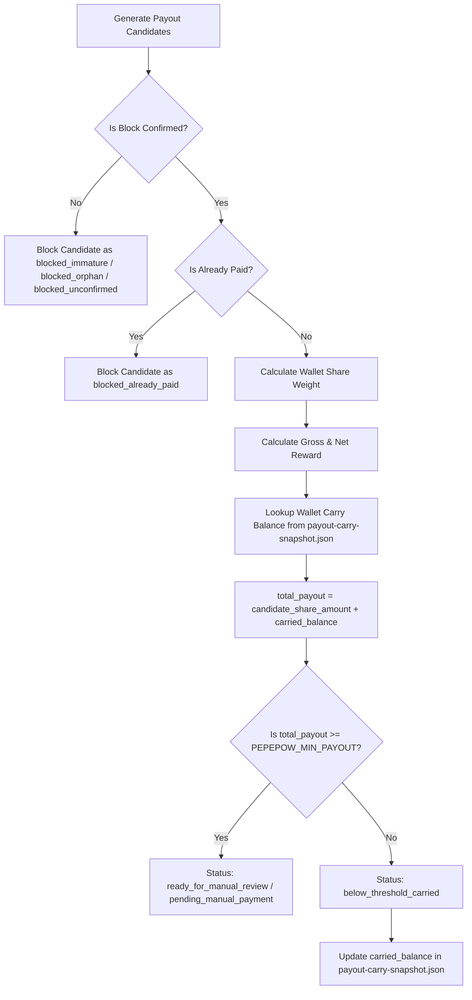

# Below-Threshold Balance Carry Design: PEPEPOW Manual Payout

Date: 2026-06-06
Status: Proposed Design
Scope: Balance Carry and Below-Threshold Handling

---

## 1. Goal

This document defines the design for handling below-threshold payout amounts and balance carry-forward in the PEPEPOW manual payout flow.

Future blocks may produce wallet payout amounts that are below the minimum payout threshold (`PEPEPOW_MIN_PAYOUT`). Rather than discarding these or paying them out immediately, we must carry them forward to future payouts while maintaining the safety and manual-only constraints of the MVP.

---

## 2. Design Constraints & Principles

To maintain simplicity, security, and predictability, we adhere strictly to the following constraints:

1. **No Wallet RPC**: The system will not interact with the wallet daemon RPC for payouts, automated sweeping, or sending coins.
2. **No Automatic Payout**: No daemon, worker, or cron job will automatically send payouts to miners.
3. **No Payout Worker**: Payout candidate generation and manual recording remain manual script-driven commands.
4. **No Redis or Database**: State is entirely file-based, stored in the local file system.
5. **No Public Admin Endpoint**: No endpoints are exposed to trigger payments, modify states, or trigger carry adjustments.
6. **No Frontend Claim/Pay Button**: Miners cannot claim balances via the frontend, and operators cannot initiate payments from the web UI.
7. **No Public Balance Display**: To avoid implying a payable balance before the implementation is fully complete and tested, the frontend and API must not display carried balances publicly.
8. **No Parsing Raw JSONL on Request Path**: The public API `/api/payments` must read from a pre-compiled, static JSON snapshot and never parse raw append-only JSONL files.
9. **Atomic Snapshots**: All snapshot files must be written atomically (write to temporary file, then rename/replace).

---

## 3. Data Model & State Files

To persist carried balance state safely, we introduce a minimal file model.

### 3.1 `payout-carry-snapshot.json`

This file is a JSON snapshot stored in the runtime directory. It is the single source of truth for the current carried balance of each miner wallet.

- Path: `.runtime/live-stratum/payout-carry-snapshot.json`
- Write Behavior: Atomic write (via temp file replacement).

Example structure:
```json
{
  "updated_at": "2026-06-06T16:00:00Z",
  "balances": {
    "PEPEPOW1WalletAddressTarget001": 250.50,
    "PEPEPOW1WalletAddressTarget002": 10500.00
  }
}
```

### 3.2 `payout-carry-actions.jsonl` (Optional / Future Phase)

For auditability and diagnostics, we can optionally log every change to the carried balance as append-only events.

- Path: `.runtime/live-stratum/payout-carry-actions.jsonl`
- Write Behavior: Append-only log.

Example row:
```json
{"timestamp": "2026-06-06T16:00:00Z", "action": "carry_added", "wallet": "PEPEPOW1WalletAddressTarget001", "amount": 250.50, "candidate_id": "height-4573284"}
{"timestamp": "2026-06-06T16:30:00Z", "action": "carry_cleared", "wallet": "PEPEPOW1WalletAddressTarget002", "amount": 10500.00, "candidate_id": "height-4573350"}
```

---

## 4. Proposed Payout Candidate Statuses

We introduce and use the following statuses to categorize candidates and individual wallet payouts:

| Status | Type | Description |
| :--- | :--- | :--- |
| `below_threshold_carried` | Payout / Wallet | The calculated net payout for this block's round is below the minimum threshold and has been carried forward. |
| `carried_forward` | Payout / Wallet | The payout amount has been moved forward and added to the carry state. |
| `ready_for_manual_review` | Candidate | The candidate block is confirmed, has valid shares, and is ready for manual review. |
| `blocked_already_paid` | Candidate | A manual payment record matching this candidate hash (and wallet) already exists. |
| `blocked_immature` | Candidate | The block is confirmed but has not reached the maturity threshold yet (not payable). |
| `blocked_orphan` | Candidate | The block is verified as an orphan on-chain (not payable). |
| `blocked_unconfirmed` | Candidate | The block has unconfirmed lifecycle status in the pool or blockchain. |
| `blocked_missing_round` | Candidate | The block lacks corresponding round shares data. |
| `blocked_zero_weight` | Candidate | The round associated with the block has a total share difficulty score of 0. |

---

## 5. State Transition & Core Logic

### 5.1 Balance Carry-Forward Model



### 5.2 How Carry is Added Into Future Candidates

During `payout-candidates` command execution:
1. Load the `payout-carry-snapshot.json` to get the mapping of `wallet -> carried_balance`.
2. For each eligible pool block candidate:
   - Compute each miner's `net_share_reward` for the round.
   - Look up the wallet's `carried_balance` from the snapshot.
   - Calculate `total_payout = net_share_reward + carried_balance`.
   - If `total_payout >= PEPEPOW_MIN_PAYOUT`:
     - The payout item is generated with the `total_payout` amount.
     - Its status is set to `pending_manual_payment` or `ready_for_manual_review`.
   - If `total_payout < PEPEPOW_MIN_PAYOUT`:
     - The payout item is generated with status `below_threshold_carried`.
     - The miner's `carried_balance` in the local map is updated: `new_carried_balance = total_payout`.
     - No manual payment list item is shown for this wallet for this candidate.
3. Write the updated carry map back to `payout-carry-snapshot.json` atomically.

### 5.3 How Manual Payment Recording Reduces or Clears Carried Balance

When the operator runs:
```bash
./ops/scripts/live-stratum.sh record-payment \
  --candidate-id <id> \
  --wallet <wallet> \
  --amount <amount> \
  --txid <txid>
```

The script will:
1. Verify that the candidate exists in `payout-candidates.json` and is `ready_for_manual_review`.
2. Verify that the recorded payout amount matches the candidate's proposed payout amount (which included the carried balance).
3. If valid, append the event to `payment-actions.jsonl` and regenerate `payments-snapshot.json`.
4. Clear the wallet's carried balance in `payout-carry-snapshot.json` (set it to `0.0` or delete the key) since the entire carried balance was rolled into this candidate's payout and has now been paid.
5. Write `payout-carry-snapshot.json` atomically.

### 5.4 Safety and Invariant Rules

- **Orphan / Immature Blocks remain non-payable**: Blocks in `blocked_orphan` or `blocked_immature` states are completely skipped from share/payout calculations. They never contribute to `carried_balance` and are not payable.
- **Already-paid candidates remain blocked**: If a candidate has status `blocked_already_paid`, it is ignored in subsequent candidate generation loops. It cannot re-add or clear carry.
- **Fail Closed**: If the `payout-carry-snapshot.json` file is malformed or unreadable, the command must abort with a non-zero exit code to prevent incorrect calculations. If the file is missing, the tool starts from zero carried balance safely.
- **No public API exposure**: The `/api/payments` endpoint returns only recorded completed manual payments from `payments-snapshot.json`. The `/api/miner/<wallet>` endpoint does not return any estimated carry, pending balance, or payable balance.

---

## 6. Implementation Phases

We propose implementing this functionality in five isolated, incremental phases:

* **Phase 1: Internal carry snapshot only**  
  Implement the structure and model of `payout-carry-snapshot.json`. Add utility methods to read, write, and initialize from zero if missing.

* **Phase 2: Payout candidate generator consumes carry snapshot**  
  Upgrade `payout_helper.py`'s candidate generation. It must load the carry snapshot, evaluate payouts against `PEPEPOW_MIN_PAYOUT`, and write carry-forward updates atomically.

* **Phase 3: Manual payment recording clears paid carry**  
  Integrate carry clearing into the `record-payment` command. Recording a payment resets the corresponding wallet's carried balance to zero in the snapshot.

* **Phase 4: API exposes recorded manual payments only**  
  Ensure `/api/payments` and `/api/miner/<wallet>` continue to only list recorded payments. Double-check that carry-forward state remains purely internal.

* **Phase 5: Public carry/balance display only after correctness tests**  
  Once extensive unit and integration tests pass, we can optionally expose the miner's current carried balance on the frontend and API under a new field.

---

## 7. Focused Future Test List

We will write unit tests in `tests/test_payout_accounting.py` to assert the following behaviors:

1. **below-threshold amount is carried, not paid**  
   Assert that when a wallet's payout is below `PEPEPOW_MIN_PAYOUT`, the candidate generator sets status to `below_threshold_carried`, does not list it as `pending_manual_payment`, and persists the amount to the carry snapshot.
2. **carried amount is added to next confirmed payout**  
   Assert that a wallet's carried amount from a previous run is correctly added to its calculated reward in the next candidate block.
3. **manual payment clears matching carry**  
   Assert that recording a payment for a candidate that rolled in a carry amount resets that wallet's carried balance in the snapshot to `0`.
4. **orphan/immature blocks never enter carry**  
   Assert that round rewards from orphan (`blocked_orphan`) or immature (`blocked_immature`) blocks are never computed or added to the carry snapshot.
5. **duplicate paid candidate does not re-add carry**  
   Assert that candidates marked as `blocked_already_paid` are skipped and do not alter the carry snapshot.
6. **missing carry snapshot starts from zero safely**  
   Assert that if `payout-carry-snapshot.json` does not exist, the generator starts with `0` carried balance for all miners and executes successfully.
7. **malformed carry snapshot fails closed**  
   Assert that if `payout-carry-snapshot.json` contains malformed JSON, the candidate generator fails with an error and does not proceed.
8. **API does not expose carry as payable balance**  
   Assert that the `/api/payments` and `/api/miner/<wallet>` endpoints do not leak internal carry balance state.
